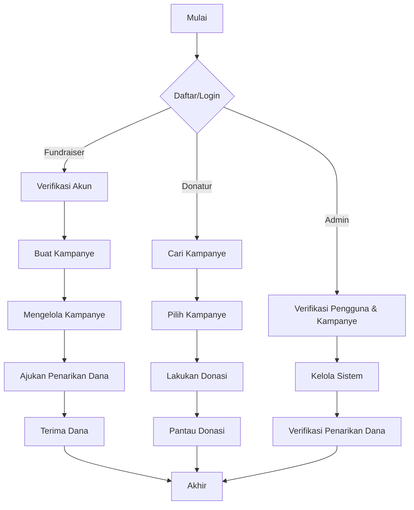

# Sistem Informasi Galangdana berbasis Web menggunakan Framework Laravel 11

Sebuah platform penggalangan dana online yang menghubungkan berbagai jenis penggalang dana (individu, organisasi non-profit, lembaga pendidikan) dengan para donatur potensial. Platform ini dirancang untuk memfasilitasi berbagai jenis kampanye penggalangan dana, mulai dari bantuan bencana alam, pendanaan pendidikan, hingga proyek-proyek sosial dan kemanusiaan.
<br> <br>
Sistem ini memungkinkan penggalang dana untuk membuat dan mengelola kampanye mereka, sementara donatur dapat dengan mudah menemukan dan mendukung kampanye yang sesuai dengan minat mereka. Platform ini juga menyediakan fitur kategorisasi kampanye, sistem fase penggalangan dana, dan mekanisme penarikan dana yang transparan.
<br> <br>
Untuk menjamin keamanan dan kepercayaan, sistem ini mengimplementasikan proses verifikasi penggalang dana dan kampanye oleh tim admin. Selain itu, terdapat fitur pelaporan donasi dan penggunaan dana yang transparan untuk meningkatkan akuntabilitas.
<br> <br>
Platform ini membutuhkan sebuah aplikasi web yang dapat mengelola seluruh aspek proses penggalangan dana, mulai dari pendaftaran pengguna, pembuatan kampanye, proses donasi, hingga penarikan dan distribusi dana. Aplikasi harus dapat memfasilitasi interaksi antara penggalang dana, donatur, dan administrator sistem.
<br> <br>
Untuk menggunakan platform, pengguna diwajibkan untuk mendaftar dan memverifikasi akun mereka. Penggalang dana harus melalui proses verifikasi tambahan sebelum dapat membuat kampanye. Setiap kampanye yang dibuat harus disetujui oleh admin sebelum dipublikasikan.
<br> <br>
Sistem ini akan dikembangkan menggunakan framework Laravel, memanfaatkan Blade templating untuk interaktivitas, dan menggunakan Spatie Permission untuk manajemen peran dan izin pengguna. Tujuannya adalah menciptakan platform penggalangan dana yang aman, efisien, dan mudah digunakan bagi semua pihak yang terlibat.

## Alur Penggunaan Aplikasi

1. Pendaftaran dan Autentikasi Pengguna
   - Pengguna mendaftar sebagai fundraiser atau donatur
   - Verifikasi email
   - Login ke sistem

2. Penggalang Dana (Fundraiser)
   a. Verifikasi Akun Fundraiser
      - Mengisi formulir verifikasi
      - Menunggu persetujuan admin
   b. Membuat Kampanye
      - Mengisi detail kampanye (judul, deskripsi, target dana, dll.)
      - Menentukan kategori kampanye
      - Mengatur fase-fase kampanye (opsional)
      - Mengunggah gambar atau dokumen pendukung
   c. Mengelola Kampanye
      - Memantau progres donasi
      - Memperbarui informasi kampanye
      - Berinteraksi dengan donatur melalui update kampanye
   d. Penarikan Dana
      - Mengajukan permintaan penarikan dana
      - Menunggu verifikasi dan persetujuan admin
      - Menerima dana yang telah diverifikasi

3. Donatur
   a. Menjelajahi Kampanye
      - Mencari kampanye berdasarkan kategori atau kata kunci
      - Melihat detail kampanye
   b. Melakukan Donasi
      - Memilih jumlah donasi
      - Memilih metode pembayaran
      - Melakukan pembayaran
      - Menerima konfirmasi donasi
   c. Memantau Donasi
      - Melihat riwayat donasi
      - Menerima update kampanye yang didukung

4. Administrator
   a. Verifikasi Pengguna
      - Memeriksa dan menyetujui akun fundraiser
   b. Manajemen Kampanye
      - Mereview dan menyetujui kampanye baru
      - Memantau aktivitas kampanye
   c. Verifikasi Penarikan Dana
      - Mereview permintaan penarikan dana
      - Memproses dan menyetujui penarikan yang valid
   d. Pengelolaan Sistem
      - Mengelola kategori kampanye
      - Memantau aktivitas platform secara keseluruhan
      - Menangani laporan atau masalah yang muncul

5. Penutupan Kampanye
   - Kampanye ditutup otomatis saat target tercapai atau batas waktu berakhir
   - Fundraiser membuat laporan akhir penggunaan dana
   - Admin melakukan review final

6. Evaluasi dan Pelaporan
   - Sistem menghasilkan laporan statistik kampanye
   - Fundraiser dan admin dapat mengakses data untuk evaluasi
  
## Flowchart Sistem



## Fitur Utama

- Manajemen pengguna (pendaftaran, login, profil)
- Pembuatan dan pengelolaan kampanye penggalangan dana
- Sistem donasi yang aman
- Pencarian dan filter kampanye berdasarkan kategori
- Pengelolaan fase kampanye
- Sistem penarikan dana dengan verifikasi admin
- Dashboard admin untuk manajemen konten dan verifikasi

## Teknologi

- Backend: Laravel 11
- Frontend: Blade
- CSS: Tailwind CSS
- Autentikasi: Laravel Breeze
- Otorisasi: Spatie Laravel-permission
- Database: MySQL

## Persyaratan Sistem

- PHP >= 8.1
- Composer
- Node.js >= 14.x
- NPM >= 6.x

## Struktur Database (ERD)


### Penjelasan Entitas:
1. **users**
   - Menyimpan informasi pengguna sistem.
   - Atribut: id, name, avatar, email, email_verified_at, password, remember_token, created_at, updated_at

2. **fundraisers**
   - Mengelola data penggalang dana.
   - Atribut: id, user_id, is_active, deleted_at, created_at, updated_at

3. **fundraisings**
   - Menyimpan informasi kampanye penggalangan dana.
   - Atribut: id, name, slug, target_amount, about, is_active, has_finished, thumbnail, fundraiser_id, category_id, deleted_at, created_at, updated_at

4. **categories**
   - Kategori untuk kampanye penggalangan dana.
   - Atribut: id, name, slug, icon, deleted_at, created_at, updated_at

5. **fundraising_phases**
   - Mengelola fase-fase dalam kampanye penggalangan dana.
   - Atribut: id, name, notes, photo, fundraising_id, deleted_at, created_at, updated_at

6. **fundraising_withdrawals**
   - Mencatat penarikan dana dari kampanye.
   - Atribut: id, proof, bank_name, bank_account_number, bank_account_name, amount_requested, amount_received, has_received, has_sent, fundraiser_id, fundraising_id, deleted_at, created_at, updated_at

7. **donaturs**
   - Menyimpan informasi donatur.
   - Atribut: id, name, phone_number, fundraising_id, total_amount, notes, proof, is_paid, deleted_at, created_at, updated_at

### Relasi Antar Entitas:

- **users** - **fundraisers**: One-to-One
- **fundraisers** - **fundraisings**: One-to-Many
- **fundraisings** - **categories**: Many-to-One
- **fundraisings** - **fundraising_phases**: One-to-Many
- **fundraisings** - **fundraising_withdrawals**: One-to-Many
- **fundraisings** - **donaturs**: One-to-Many

Struktur database ini dirancang untuk mendukung semua fitur utama sistem, termasuk manajemen pengguna, kampanye penggalangan dana, donasi, dan penarikan dana.

## Instalasi

1. Clone repositori
 ```
 git clone https://github.com/adrianramadhan/galangdana-webapp.git
 ```
3. Masuk ke direktori proyek
 ```
 cd galangdana-webapp
 ```
5. Instal dependensi PHP
 ```
 composer install
 ```
7. Instal dependensi JavaScript
 ```
 npm install
 ```
9. Salin file .env.example menjadi .env dan sesuaikan konfigurasi database
10. Generate app key
 ```
 php artisan key:generate
 ```
12. Jalankan migrasi database
 ```
 php artisan migrate
 ```
14. Compile asset
 ```
 npm run dev
 ```
16. Jalankan server development
 ```
 php artisan serve
 ```

## Kontribusi

Kami menyambut kontribusi dari komunitas. Silakan buat pull request atau laporkan issues jika Anda menemukan bug atau memiliki saran perbaikan.

## Lisensi

Proyek ini dilisensikan di bawah [MIT License](LICENSE).

## Kontak

Untuk pertanyaan atau informasi lebih lanjut, silakan hubungi [adrianramadhan881@gmail.com](mailto:adrianramadhan881@gmail.com).
